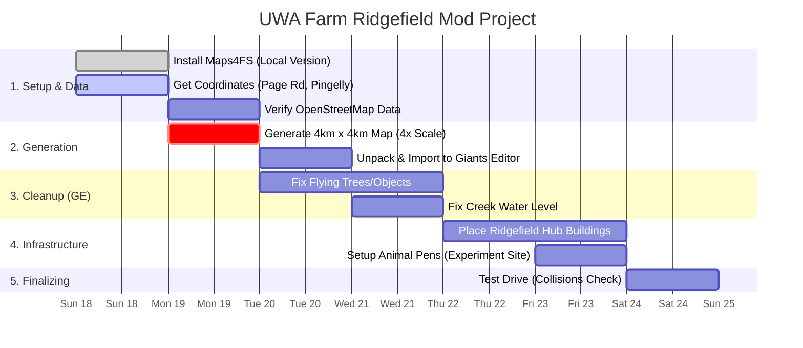

```mermaid
gantt
    title UWA Farm Ridgefield Mod Project
    dateFormat  YYYY-MM-DD
    axisFormat  %a %d

    section 1. Setup & Data
    Install Maps4FS (Local Version)      :done,    t1, 2026-01-18, 1d
    Get Coordinates (Page Rd, Pingelly)  :active,  t2, 2026-01-18, 1d
    Verify OpenStreetMap Data            :         t3, 2026-01-19, 1d

    section 2. Generation
    Generate 4km x 4km Map (4x Scale)    :crit,    t4, 2026-01-19, 1d
    Unpack & Import to Giants Editor     :         t5, 2026-01-20, 1d

    section 3. Cleanup (GE)
    Fix Flying Trees/Objects             :         t6, 2026-01-20, 2d
    Fix Creek Water Level                :         t7, 2026-01-21, 1d

    section 4. Infrastructure
    Place Ridgefield Hub Buildings       :         t8, 2026-01-22, 2d
    Setup Animal Pens (Experiment Site)  :         t9, 2026-01-23, 1d

    section 5. Finalizing
    Test Drive (Collisions Check)        :         t10, 2026-01-24, 1d
```